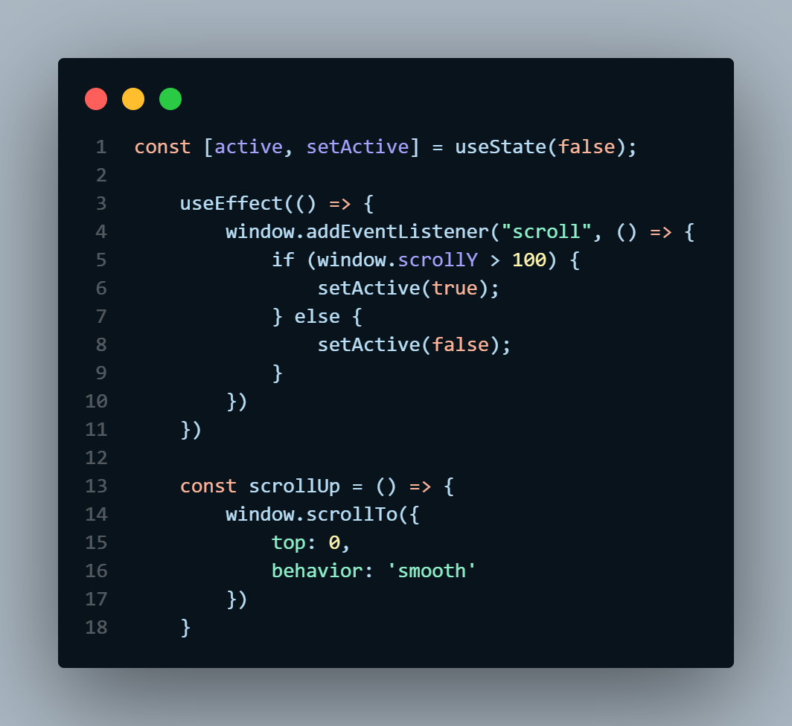

<h1 align='center'>Recipy App</h1>


<h2 align='center'>Discover all the popular meals around and learn how to cook them.</h2>


<details>
  <summary>Table of Contents</summary>
  <ol>
    <li>
      <a href="#about-the-project">About The Project</a>
      <ul>
        <li><a href="#built-with">Built With</a></li>
      </ul>
    </li>
    <li>
      <ul>
        <li><a href="#prerequisites">Prerequisites</a></li>
        <li><a href="#installation">Installation</a></li>
      </ul>
    </li>
    <li><a href="#description">Description</a></li>
    <li><a href="#dependencies">Desktop View</a></li>
    <li><a href="#code-snippets">Mobile View</a></li>
    <li><a href="#authors">Authors</a></li>
  </ol>
</details>


## About the project

This is the website where you'll find some popular meals around the world. It has amazing features including **search**, **look for meals by first letter**, **Get random meals**, **View meal details and category details** and much more. The UI iis user friendly and allows you to navigate thorough the website without getting lost. The making of this entire website was possible with [The mealdb API](https://www.themealdb.com/api.php).

#  Features
<ul>
<li>Search for specific meals
<li>See all meals by category
<li>Get all details about a meal
<li>Look for meals by first letter
<li>Get Random meals 
<li>Toggle between light and dark theme
</ul>

## Built with:
- [React](https://legacy.reactjs.org/) - JS library
- [Next.js 13](https://nextjs.org/) - React Framework
- [Tailwind CSS](https://tailwindcss.com/) - CSS framework
- [Framer Motion](https://www.framer.com/motion/) - For animations
- [Headless UI](https://headlessui.com/) - For useful UI components
- [React Icons](https://react-icons.github.io/react-icons) - For icons


## Prerequisites

Getting Started
You need to have [Node js](https://nodejs.org/en/download) installed.
This is a [Next.js](https://nextjs.org/) project bootstrapped with [`create-next-app`](https://github.com/vercel/next.js/tree/canary/packages/create-next-app).

## Installation

To install the necessary dependencies `cd recipy-app` and run `npm install` in your terminal.

First, run the development server:

```bash
npm run dev
# or
yarn dev
# or
pnpm dev
```

Open [http://localhost:3000](http://localhost:3000) with your browser to see the result.

You can start editing the pages. The pages auto-update as you edit the files.

## Code snippets
Here are some code that I found useful while developing the app:




## Learn More

To learn more about Next.js, take a look at the following resources:

- [Next.js Documentation](https://nextjs.org/docs) - learn about Next.js features and API.
- [Learn Next.js](https://nextjs.org/learn) - an interactive Next.js tutorial.

## Deployed on Vercel

- Live Site URL: [Recipy](https://https://recipes-app-cj7m.vercel.app/)

## Authors

<a href="https://www.linkedin.com/in/dytoma-batogouma-6aa946235/">Dytoma Batogouma</a></br>

